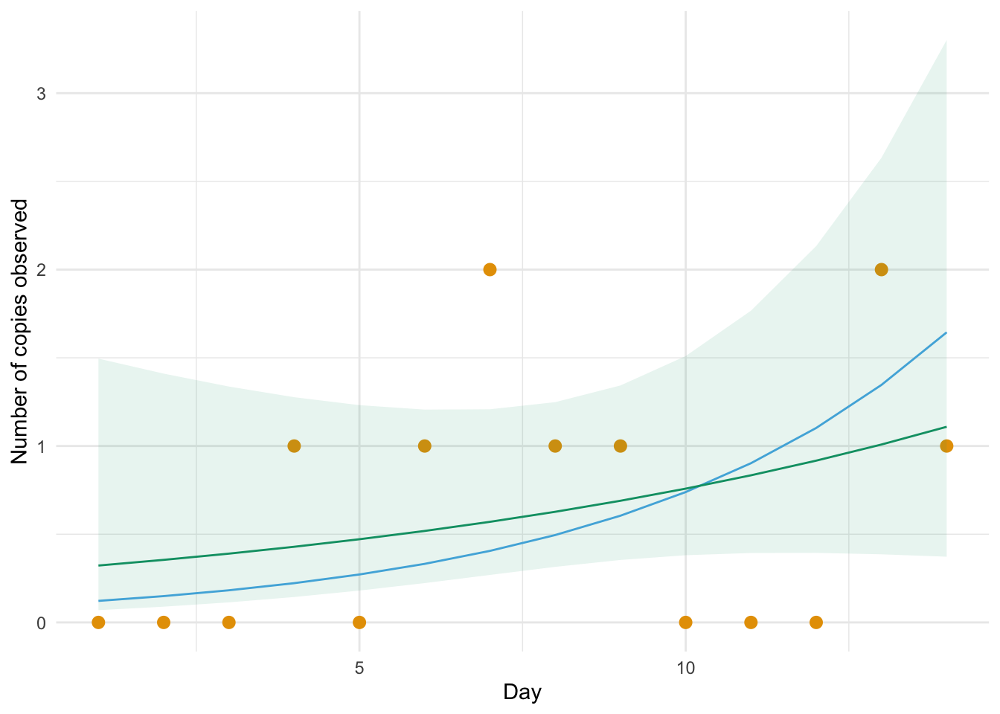
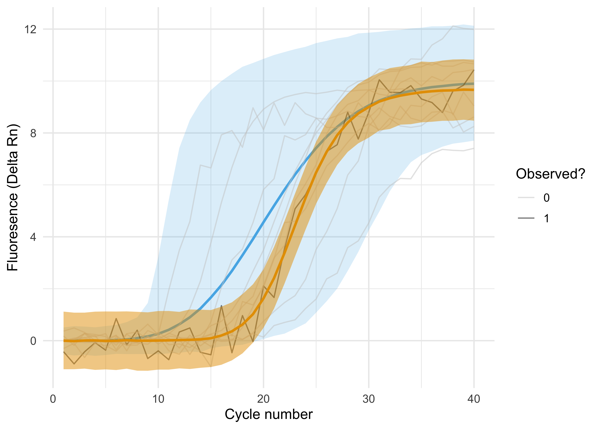

# exp-growth

This repository contains work I did over June - August 2022 at the [Nucleic Acid Observatory](https://www.naobservatory.org/), MIT Media Lab.
My focus was primarily on [computational threat detection](https://naobservatory.org/computational-threat-detection/) of emerging pandemics using exponential growth detection of environmental metagenomic data.
Poisson regression works well for this in easy simulated cases, and it remains to be seen for more realistic ones.
See:

* [Poisson regression as an approach to exponential growth detection](https://athowes.github.io/exp-growth/all-hands)
* [Estimating exponential growth via sporadic detection](https://athowes.github.io/exp-growth/exponential-detection)
* [Exponential growth detection on metagenomic data](https://athowes.github.io/exp-growth/egd-metagenomic)

I also began developing a Bayesian generative model for qPCR, modelling the amplification curve rather than only $C_t$.
Why?
Emerging pathogens will be near the lower limit of detection, such that (hypothetically) stochasticity in the qPCR process shouldn't be ignored.
See:

* [A generative model for qPCR data](https://athowes.github.io/exp-growth/qPCR)

If you're interested by this work, feel free to get in touch with me, or take a look at what [SecureBio](https://securebio.org/) have been doing more recently!
